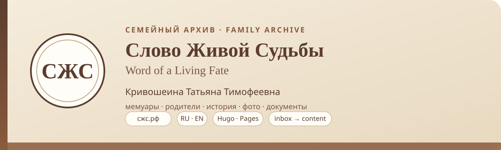
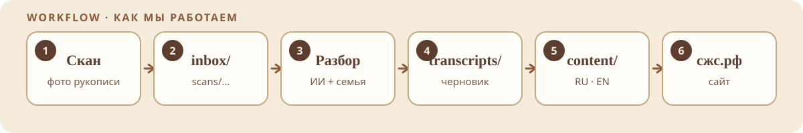
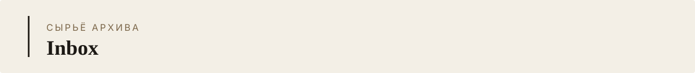
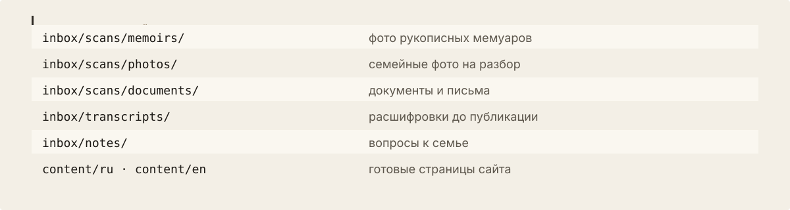
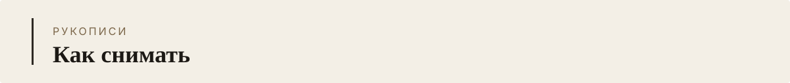
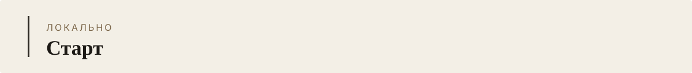

<p align="center">
  
</p>

<p align="center">
  <a href="https://сжс.рф/"><strong>сжс.рф</strong></a>
  ·
  <a href="https://сжс.рф/en/">English</a>
  ·
  <a href="https://krivoshein-slon.sourcecraft.site/szhz/">SourceCraft</a>
  ·
  <a href="./docs/WORKFLOW.md">Инструкция</a>
</p>

Семейный архив о **Кривошеиной Татьяне Тимофеевне**: мемуары, родители, фото, документы. Русский по умолчанию, английский на `/en/`.

Сайт — статика на [Hugo](https://gohugo.io/) + [PaperMod](https://github.com/adityatelange/hugo-PaperMod). Исходники здесь; публикация — GitHub Pages и [SourceCraft Sites](https://sourcecraft.dev/krivoshein-slon/szhz).

---

<p align="center">
  
</p>

| RU | EN |
| --- | --- |
| [Воспоминания](https://сжс.рф/vospominaniya/) | [Memoirs](https://сжс.рф/en/memoirs/) |
| [Родители](https://сжс.рф/roditeli/) | [Parents](https://сжс.рф/en/parents/) |
| [История](https://сжс.рф/istoriya/) | [History](https://сжс.рф/en/history/) |
| [Фото](https://сжс.рф/foto/) | [Photos](https://сжс.рф/en/photos/) |
| [Документы](https://сжс.рф/dokumenty/) | [Documents](https://сжс.рф/en/documents/) |
| [Поиск](https://сжс.рф/search/) | [Search](https://сжс.рф/en/search/) |

---

<p align="center">
  
</p>

1. Семья снимает тетради → `inbox/scans/`
2. Разбор в чате, расшифровка → `inbox/transcripts/`
3. После проверки фактов — страницы в `content/ru/` и `content/en/` (один `translationKey`)
4. Push в `main` собирает сайт

Полная памятка: [docs/WORKFLOW.md](./docs/WORKFLOW.md)

---

<p align="center">
  
</p>

<p align="center">
  
</p>

Inbox — для семьи, не для посетителя сайта. Сами фото в git **не коммитятся**. См. [inbox/README.md](./inbox/README.md).

<p align="center">
  
</p>

Ровный свет, страница целиком, имена `001.jpg`, `002.jpg`…, не сжимать «в ноль».

---

<p align="center">
  
</p>

```bash
git submodule update --init --recursive
hugo server -D
```

Новая парная запись:

```bash
hugo new content/ru/vospominaniya/nazvanie.md --kind memoir
hugo new content/en/memoirs/name.md --kind memoir
```

### Публикация

| Куда | Как |
| --- | --- |
| GitHub Pages | push в `main` → workflow **Deploy Hugo site to Pages** |
| SourceCraft Sites | зеркало без своего домена: CI собирает с `baseURL` `/szhz/`, `noindex` → [длинная ссылка](https://krivoshein-slon.sourcecraft.site/szhz/) |

Конфиг хостинга: [`.sourcecraft/sites.yaml`](./.sourcecraft/sites.yaml). Свой домен `сжс.рф` в панели Beget: ALIAS/CNAME на `krivoshein-slon.sourcecraft.site` (см. инструкцию в переписке / после проверки preview).

Баннеры README собираются так:

```bash
python3 scripts/generate_readme_assets.py
```
